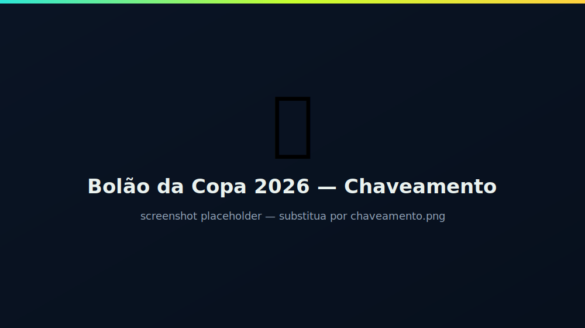
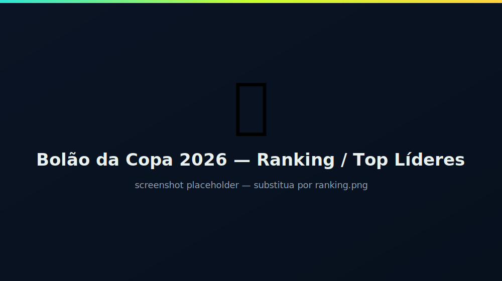
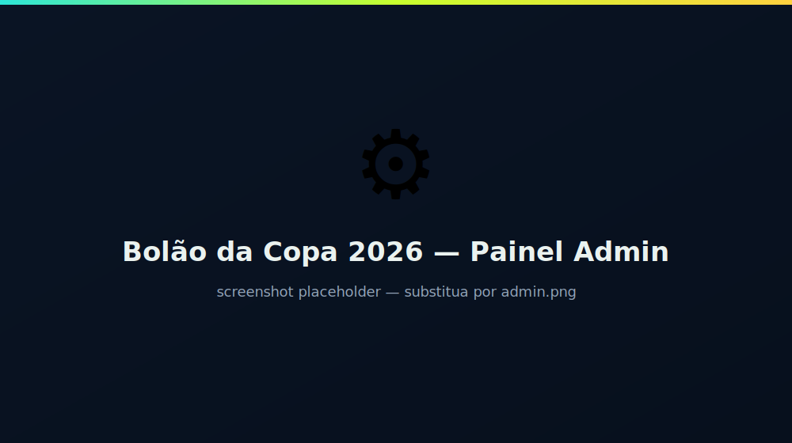

# 🏆 Bolão da Copa 2026 — ServiceNow

Aplicativo de **bolão da Copa do Mundo FIFA 2026** construído na plataforma **ServiceNow** com o **ServiceNow SDK (Fluent)** e um front-end **React (BYOUI)**. Cada participante começa com **1000 estalecas** (moeda fictícia), aposta nos jogos e sobe no ranking conforme acerta os placares.

Portal esportivo e responsivo (funciona no desktop e no celular), com cards envolventes, ranking com pódio, perfil com conquistas, chaveamento dos mata-matas e painel administrativo.

---

## 📸 Screenshots

| Jogos & Apostas | Chaveamento | Ranking |
|---|---|---|
|  |  |  |

| Perfil & Conquistas | Painel Admin |
|---|---|
|  |  |

> As imagens acima são **placeholders**. Substitua os arquivos em `docs/screenshots/` pelas capturas reais do portal (mantenha os nomes ou troque para `.png` e atualize os links).

---

## ✨ Funcionalidades

- **Aposta com payout**: cada palpite tem um valor apostado (estalecas).
  - 🎯 **Placar exato** → paga **5×** a aposta
  - ✅ **Acertou o vencedor/empate** (placar errado) → paga **2×**
  - ❌ **Errou** → perde a aposta
- **Ranking / Top Líderes**: pódio dos 3 primeiros + tabela com saldo, placares exatos, aproveitamento e conquistas.
- **Chaveamento interativo**: Oitavas → Quartas → Semifinais → Final. O vencedor de cada confronto **avança automaticamente** para a próxima fase à medida que os resultados são lançados.
- **Perfil**: saldo de estalecas, estatísticas, histórico de palpites e prateleira de conquistas (badges).
- **Conquistas / Badges**: Estreante, Vidente (placar exato), Sequência de Fogo (3 exatos), Caçador de Zebras, High Roller.
- **Painel administrativo** (no portal): lançar resultados, abrir/fechar apostas e disparar a liquidação automática.
- **Menu nativo do ServiceNow** amarrado às roles + módulos de lista para gestão de registros.
- **Notificação por e-mail** quando um palpite é liquidado.
- **48 seleções**, **12 grupos** e fixtures da fase de grupos (com placares reais dos jogos já disputados) + bracket dos mata-matas.

---

## 🧱 Arquitetura

| Camada | Implementação |
|---|---|
| **Dados** | 6 tabelas Fluent: `team`, `match`, `wallet`, `bet`, `achievement`, `user_badge` (prefixo `x_snc_bolao_da_cop_`) |
| **Regras de negócio** | Script Include `BolaoEngine` (carteira, cálculo de payout, liquidação, conquistas) + Business Rules (validação de palpite, débito/crédito de carteira, liquidação no encerramento) |
| **Automação** | Scheduled Script que fecha apostas no horário do jogo; EmailNotification de liquidação |
| **Segurança** | Roles `player` e `admin`; ACLs por tabela; System Properties para multiplicadores |
| **Navegação** | `ApplicationMenu` + módulos `sys_app_module` (role-tied) |
| **Front-end** | React 19 (BYOUI) bundlado via Rollup; acesso a dados pela **REST Table API** com `X-UserToken` |

### Mecânica da carteira
A carteira de **1000 estalecas é criada automaticamente no primeiro palpite** do usuário. Até apostar, o saldo aparece como 0 (uma nota de boas-vindas explica isso e some após o primeiro palpite). A cada aposta o valor é debitado; na liquidação do jogo o retorno é creditado.

Os multiplicadores são **System Properties** ajustáveis sem código:

| Property | Padrão | Descrição |
|---|---|---|
| `x_snc_bolao_da_cop.payout.exact` | `5` | Multiplicador do placar exato |
| `x_snc_bolao_da_cop.payout.winner` | `2` | Multiplicador de acerto do vencedor |
| `x_snc_bolao_da_cop.initial_balance` | `1000` | Saldo inicial |

---

## 🛠️ Pré-requisitos

- **Node.js** 18+ e **npm**
- **ServiceNow SDK** (`@servicenow/sdk`) — instalado por projeto via `npm install`
- Uma instância ServiceNow (testado em `nowdemo.service-now.com`) com acesso de desenvolvedor

---

## 🚀 Instalação

### 1. Clonar o repositório
```bash
git clone https://github.com/glauccop/ServiceNow-Bolao-da-Copa-2026.git
cd ServiceNow-Bolao-da-Copa-2026
```

### 2. Instalar dependências
```bash
npm install
```

### 3. Autenticar na instância
```bash
npx now-sdk auth --add https://SUA-INSTANCIA.service-now.com
```
Confirme com `npx now-sdk auth --list`.

> **Atenção:** o `now.config.json` contém o `scope` e o `scopeId` do app de origem. Para instalar em **outra** instância/escopo, ajuste esses valores (ou rode `npx now-sdk init` para criar um novo app e migrar os fontes de `src/`).

### 4. (Opcional) Regenerar o seed de dados
Os dados das seleções, jogos e apostas demo são gerados a partir de `data/worldcup.json`:
```bash
node tools/gen-seed.mjs
```
Isso (re)cria os arquivos em `src/fluent/seed/`.

### 5. Build e deploy
```bash
npx now-sdk build      # type-check + bundle do React
npx now-sdk install    # deploy na instância autenticada
```

Após instalar, acesse o portal:
```
https://SUA-INSTANCIA.service-now.com/x_snc_bolao_da_cop_bolao.do
```

### 6. Atribuir as roles
Para ver o menu/portal e o painel admin, atribua a role ao usuário:
`User Administration → Users → (usuário) → Roles → Edit`
- `x_snc_bolao_da_cop.player` — participante
- `x_snc_bolao_da_cop.admin` — administrador (inclui `player`)

> Dica: após o deploy, faça **hard refresh** (Ctrl/Cmd + Shift + R) — os assets do BYOUI ficam em cache.

---

## 🎮 Como usar

### Participante
1. Abra o portal (ou o módulo **🎮 Abrir o Bolão** no menu do ServiceNow).
2. Na aba **Jogos**, escolha um jogo com apostas abertas, ajuste o placar (steppers) e o valor da aposta (slider) e clique em **Apostar**. Sua carteira de 1000 estalecas é criada nesse momento.
3. Acompanhe o **Ranking**, o **Chaveamento** e seu **Perfil** (saldo, histórico e conquistas).

### Administrador
- **No portal (aba Admin)**: lançar/corrigir o placar de um jogo (encerra e liquida automaticamente as apostas), abrir/fechar apostas.
- **No ServiceNow (menu Bolão da Copa 2026 → Administração)**: módulos de lista para gerenciar **Jogos, Seleções, Palpites, Carteiras, Conquistas e Conquistas dos usuários** pela interface nativa.

---

## 📁 Estrutura do projeto

```
.
├── data/
│   └── worldcup.json            # Dataset: 48 seleções + 87 jogos (grupos + mata-matas)
├── tools/
│   └── gen-seed.mjs             # Gerador dos seeds Fluent a partir do JSON
├── src/
│   ├── client/                  # Front-end React (BYOUI)
│   │   ├── index.html
│   │   ├── main.tsx
│   │   ├── app.tsx              # Orquestra abas, dados e estado
│   │   ├── app.css              # Tema esportivo + responsivo
│   │   ├── types.ts
│   │   ├── lib/leaderboard.ts   # Cálculo do ranking
│   │   ├── services/BolaoService.ts  # Cliente REST Table API
│   │   └── components/          # MatchCard, Bracket, Leaderboard, Profile, Admin, Flag
│   └── fluent/                  # Metadados ServiceNow (Fluent)
│       ├── tables/tables.now.ts
│       ├── security/security.now.ts      # Roles, ACLs, Properties
│       ├── server/                        # BolaoEngine, business rules, scheduled, notifications
│       ├── ui-pages/bolao.now.ts          # UI Page (BYOUI)
│       ├── navigation.now.ts              # ApplicationMenu + módulos
│       └── seed/                          # Gerado por gen-seed.mjs
├── now.config.json
└── package.json
```

---

## 📦 Datasets para download

O dataset da Copa 2026 está disponível para baixar e reusar (livre):

| Arquivo | Conteúdo | Download |
|---|---|---|
| `data/worldcup.json` | Fonte completa: 48 seleções + 87 jogos (grupos e mata-matas) | [baixar](https://raw.githubusercontent.com/glauccop/ServiceNow-Bolao-da-Copa-2026/main/data/worldcup.json) |
| `data/teams.csv` | Seleções (`code,name,group,confederation,flag`) | [baixar](https://raw.githubusercontent.com/glauccop/ServiceNow-Bolao-da-Copa-2026/main/data/teams.csv) |
| `data/matches.csv` | Jogos (`match_no,stage,group,home,away,kickoff,status,home_score,away_score,venue`) | [baixar](https://raw.githubusercontent.com/glauccop/ServiceNow-Bolao-da-Copa-2026/main/data/matches.csv) |

Os CSVs são gerados a partir do JSON com:
```bash
node tools/export-csv.mjs
```

### Schema do `worldcup.json`
```jsonc
{
  "teams":   [{ "code": "BRA", "name": "Brasil", "flag": "🇧🇷", "group": "C", "confederation": "CONMEBOL" }],
  "matches": [{ "match_no": 1, "stage": "group", "group": "A", "home": "MEX", "away": "RSA",
               "kickoff": "2026-06-11 20:00:00", "status": "finished", "home_score": 2, "away_score": 0,
               "venue": "Estadio Azteca, Cidade do México" }]
}
```
`stage`: `group | r16 | qf | sf | final` · `status`: `open | closed | finished` · jogos de mata-mata sem times definidos têm `home`/`away` ausentes.

---

## 🔄 Atualizar os dados (times/jogos/resultados)

1. Edite `data/worldcup.json` (seleções e/ou placares).
2. Regenere e faça o deploy:
   ```bash
   node tools/gen-seed.mjs && npx now-sdk build && npx now-sdk install
   ```

O `gen-seed.mjs` também cria **10 apostadores demo** com palpites e saldos **precomputados** sobre os jogos já encerrados, para que o ranking nasça populado.

---

## 🧩 Bandeiras

As bandeiras são renderizadas via **imagem** (flagcdn.com) a partir do código FIFA do time — emoji de bandeira não renderiza no Windows. O mapeamento código→ISO está em `src/client/components/Flag.tsx`.

---

## 🧯 Troubleshooting

- **Portal não atualizou após deploy** → hard refresh (Ctrl/Cmd + Shift + R).
- **Saldo aparece 0** → comportamento esperado antes do primeiro palpite; a carteira nasce com 1000 ao apostar.
- **Menu não aparece** → o usuário precisa da role `x_snc_bolao_da_cop.player` (ou `.admin`).
- **Nomes/bandeiras vazios** → garanta que o seed foi gerado com `Now.ref(...)` (já tratado em `gen-seed.mjs`).

---

## ↩️ Desinstalar (rollback)

Cada `now-sdk install` gera um contexto de rollback. Para reverter, acesse na instância:
`System Applications → Rollback and Recovery` ou abra o link de rollback retornado pelo comando de instalação.

---

## 🧰 Stack

- ServiceNow SDK `@servicenow/sdk` 4.x (Fluent)
- React 19 + Rollup (`@servicenow/isomorphic-rollup`)
- TypeScript 5.5
- REST Table API (`/api/now/table/...`)

---

## 👤 Autor

**Glaucco Morais**

- 📧 [glauccop@gmail.com](mailto:glauccop@gmail.com)
- 💼 [linkedin.com/in/glaucco-morais](https://www.linkedin.com/in/glaucco-morais/)

Ficou com dúvidas, sugestões ou quer trocar uma ideia sobre ServiceNow? Fique à vontade para me chamar!

---

> Projeto demonstrativo. Os placares dos jogos já disputados foram compilados de fontes públicas e podem conter imprecisões — ajuste em `data/worldcup.json` ou no painel admin conforme necessário.
